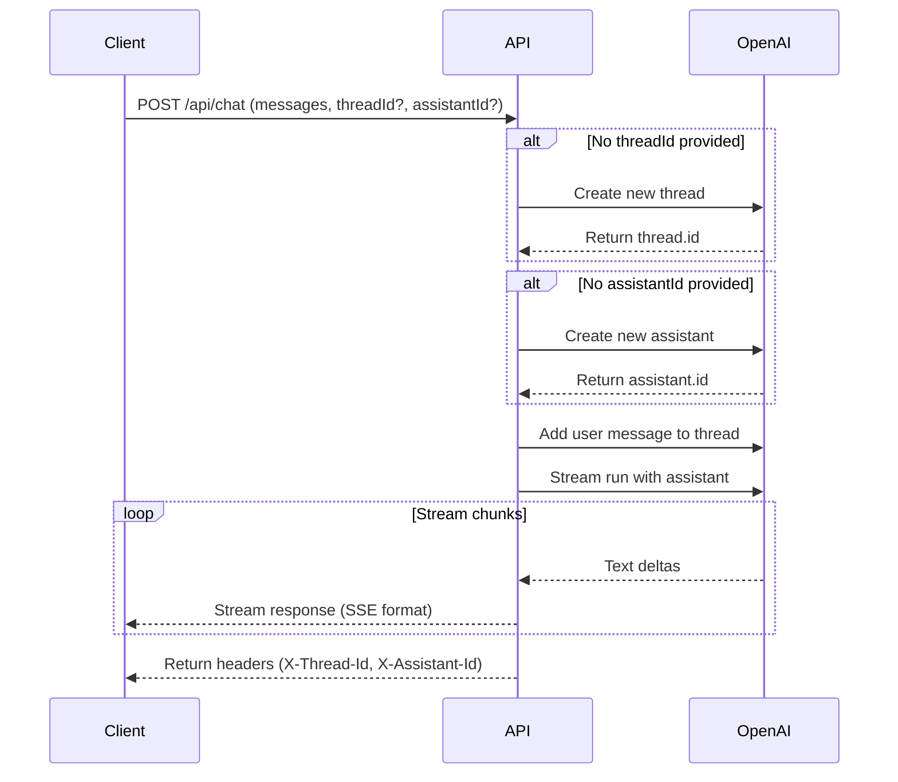

# Migration to OpenAI Assistants API

## Overview

This project has been converted from using the standard OpenAI chat completions API (via Vercel AI SDK) to the OpenAI Assistants API. This provides several advantages:

- **Persistent Threads**: Conversations are maintained in OpenAI's infrastructure
- **Built-in Memory**: The assistant automatically maintains context across messages
- **Advanced Features**: Access to tools, file search, and code interpreter capabilities
- **Stateful Conversations**: Each conversation has its own thread that persists

## Key Changes

### 1. Backend Architecture (`app/api/chat/route.ts`)

**Before (Vercel AI SDK):**
```typescript
import { streamText, convertToModelMessages } from 'ai';
import { openai } from '@ai-sdk/openai';

const result = streamText({
  model: openai('gpt-4'),
  messages: modelMessages,
  system: '...',
});
```

**After (OpenAI Assistants API):**
```typescript
import OpenAI from 'openai';

// Create/retrieve thread
const thread = await openai.beta.threads.create();

// Add message to thread
await openai.beta.threads.messages.create(threadId, {
  role: 'user',
  content: userMessage,
});

// Stream assistant response
const stream = await openai.beta.threads.runs.stream(threadId, {
  assistant_id: assistantId,
});
```

### 2. Frontend State Management (`app/page.tsx`)

**New State Variables:**
- `threadId`: Maintains the current conversation thread
- `assistantId`: Stores the assistant being used
- Custom message handling (no longer using `useChat` hook)

**Streaming Implementation:**
- Custom ReadableStream parser for assistant responses
- Manual message state management
- Thread persistence across messages

### 3. Environment Variables

```env
OPENAI_API_KEY=sk-proj-xxxxx
OPENAI_ASSISTANT_ID=asst_xxxxx  # Optional: use existing assistant
```

## Assistant Configuration

### Option 1: Use Existing Assistant

1. Go to https://platform.openai.com/assistants
2. Create a new assistant or select an existing one
3. Copy the Assistant ID (starts with `asst_`)
4. Add to `.env.local`: `OPENAI_ASSISTANT_ID=asst_xxxxx`

### Option 2: Auto-Create Assistant (Default)

If no `OPENAI_ASSISTANT_ID` is provided, the API will automatically create one with:
- **Name**: Dr. Leeron
- **Model**: GPT-4
- **Instructions**: Medical student tutor persona

## API Flow



## Message Format

### Request Body
```typescript
{
  messages: [
    {
      id: string,
      role: 'user' | 'assistant',
      parts: [{ type: 'text', text: string }]
    }
  ],
  threadId?: string,      // Optional: existing thread
  assistantId?: string    // Optional: existing assistant
}
```

### Response Stream

The API returns a `text/event-stream` with chunks in the format:
```
0:"text chunk 1"
0:"text chunk 2"
0:"text chunk 3"
```

Each line starts with `0:` followed by JSON-encoded text.

### Response Headers
```
X-Thread-Id: thread_xxxxx
X-Assistant-Id: asst_xxxxx
```

## Features Comparison

| Feature | Before (Chat Completions) | After (Assistants API) |
|---------|---------------------------|------------------------|
| Context Management | Manual (send all messages) | Automatic (thread-based) |
| State Persistence | Frontend only | OpenAI-hosted threads |
| Conversation History | Must resend each time | Stored in thread |
| Max Context | Limited by token window | Thread maintains full history |
| Advanced Tools | Manual implementation | Built-in support |
| File Upload | Not supported | Supported (file search) |
| Code Execution | Not supported | Supported (code interpreter) |

## Migration Benefits

1. **Reduced Payload Size**: Only send new messages, not entire history
2. **Server-Side State**: Conversation state managed by OpenAI
3. **Better Context**: Threads maintain unlimited conversation history
4. **Future-Proof**: Access to assistant tools and features
5. **Multi-Device**: Same thread accessible from different clients

## Upgrading from Old Version

If you have an existing deployment:

1. Update environment variables (add `OPENAI_ASSISTANT_ID` if desired)
2. Redeploy the application
3. **Note**: Old conversations will not carry over (threads are new)
4. Users will start fresh conversations with thread-based state

## API Costs

The Assistants API has different pricing than chat completions:

- **Input tokens**: Same as GPT-4
- **Output tokens**: Same as GPT-4
- **Additional costs**: Thread storage, retrieval, etc.
- **See**: https://openai.com/pricing

## Thread Management

### Thread Lifecycle

1. **Creation**: New thread created on first message
2. **Persistence**: Thread ID stored in client state
3. **Continuation**: Same thread used for follow-up messages
4. **Cleanup**: Threads persist in OpenAI until deleted

### Clearing Conversations

To start a new conversation:
```typescript
// Frontend: Clear threadId state
setThreadId(null);
```

A new thread will be created on the next message.

### Manual Thread Deletion

```typescript
// Backend API call
await openai.beta.threads.del(threadId);
```

## Debugging

### Check Thread Messages

```bash
curl https://api.openai.com/v1/threads/{thread_id}/messages \
  -H "Authorization: Bearer $OPENAI_API_KEY" \
  -H "OpenAI-Beta: assistants=v2"
```

### View Assistant Configuration

```bash
curl https://api.openai.com/v1/assistants/{assistant_id} \
  -H "Authorization: Bearer $OPENAI_API_KEY" \
  -H "OpenAI-Beta: assistants=v2"
```

### Monitor Runs

```bash
curl https://api.openai.com/v1/threads/{thread_id}/runs \
  -H "Authorization: Bearer $OPENAI_API_KEY" \
  -H "OpenAI-Beta: assistants=v2"
```

## Known Limitations

1. **No Message Editing**: Can't edit previous messages in a thread
2. **Thread Size**: Very long threads may hit context limits
3. **Streaming Format**: Custom format (not Vercel AI SDK compatible)
4. **Cold Start**: First message may be slower (thread creation)

## Future Enhancements

Potential features enabled by Assistants API:

- **File Search**: Upload medical textbooks/PDFs for reference
- **Code Interpreter**: Run calculations, draw diagrams
- **Function Calling**: Integrate medical databases, drug interactions
- **Vector Store**: Build custom knowledge base
- **Multi-Assistant**: Specialized assistants for different topics

## Rollback Instructions

If you need to revert to the old system:

1. Restore `app/api/chat/route.ts` from git history
2. Restore `app/page.tsx` from git history
3. Remove `OPENAI_ASSISTANT_ID` from environment
4. Reinstall `@ai-sdk/openai` and `@ai-sdk/react` if needed
5. Redeploy

## Additional Resources

- [OpenAI Assistants API Documentation](https://platform.openai.com/docs/assistants/overview)
- [Assistants API Quickstart](https://platform.openai.com/docs/assistants/quickstart)
- [Streaming Guide](https://platform.openai.com/docs/assistants/overview/step-4-create-a-run)
- [OpenAI Node SDK](https://github.com/openai/openai-node)

## Support

For issues or questions:
1. Check OpenAI API status: https://status.openai.com
2. Review OpenAI documentation
3. Check application logs for errors
4. Verify environment variables are set correctly
